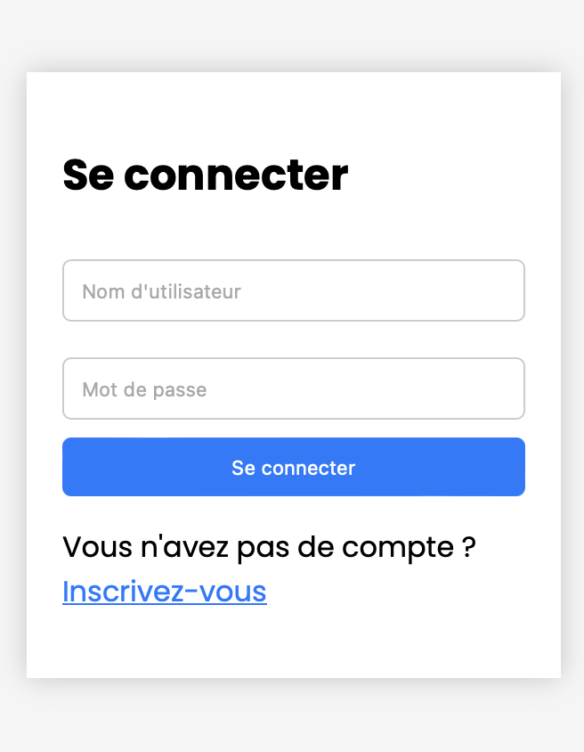

# Animated-LoginForm

Un formulaire de connexion et d'inscription animé qui permet aux utilisateurs de basculer entre les deux formulaires avec un effet de transition fade + slide.

## Fonctionnalités

- Effet de transition douce entre les formulaires de connexion et d'inscription.
- Design épuré et responsive.
- Formulaires entièrement personnalisables.
  

## Comment l'utiliser

1. Clonez ou téléchargez le répertoire.
2. Ouvrez le fichier `index.html` dans votre navigateur pour voir le formulaire en action.

## Personnalisation

- Personnaliser les formulaires, modifiez le fichier `styles.css` et `main.js` selon vos besoins.

## Contribution

Si vous souhaitez contribuer à ce projet, n'hésitez pas à forker le répertoire et à soumettre une pull request. Toute contribution est la bienvenue!
